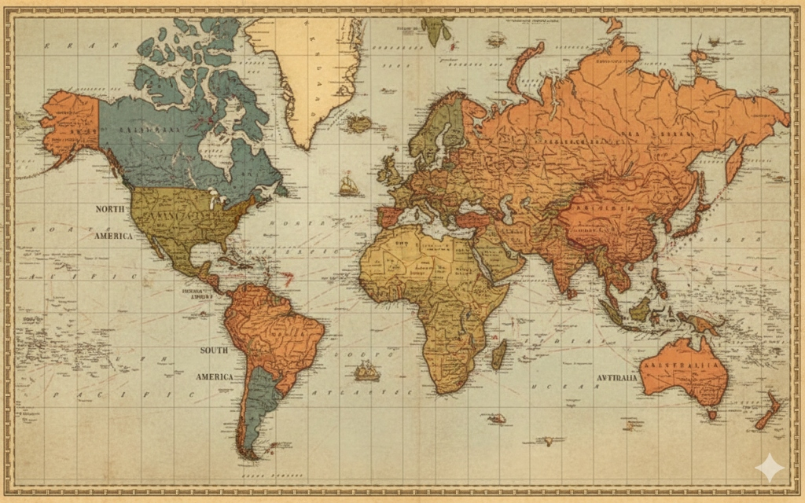

# 🌍 WorldWideFlag - Bayrak Ustası Ol!

WorldWideFlag, dünya ülkelerinin bayraklarını eğlenceli ve interaktif bir şekilde öğrenmenizi sağlayan modern bir web tabanlı quiz oyunudur.



## 🚀 Canlı Demo

Oyunun canlı versiyonunu buradan deneyebilirsiniz:  
👉 **[WorldWideFlag Canlı Demo](https://umutardatansever.github.io/BayrakOyunu/)**

---

## ✨ Özellikler

*   **🏆 İki Farklı Oyun Modu:**
    *   **Bayrak → İsim:** Gösterilen bayrağın hangi ülkeye ait olduğunu bil.
    *   **İsim → Bayrak:** Ülke ismine göre doğru bayrağı seç.
*   **🌍 Bölge Bazlı Filtreleme:** Sadece Avrupa, Asya, Amerika gibi belirli kıtaların bayraklarıyla oynayabilirsiniz.
*   **📈 İlerleme Sistemi:** Çırak seviyesinden başlayıp Bayrak Ustası olmaya giden yolda seviye atlayın.
*   **🗣️ Çoklu Dil Desteği:** Türkçe ve İngilizce dil seçenekleri.
*   **🔍 Keşfet Modu:** Tüm dünya bayraklarını, başkentlerini ve nüfus bilgilerini inceleyebileceğiniz ansiklopedi bölümü.
*   **🎨 Modern Tasarım:** Glassmorphism etkileri, akıcı animasyonlar ve şık bir arayüz.

## 🛠️ Teknolojiler

*   **HTML5**
*   **CSS3** (Modern, Responsive, Grid/Flexbox)
*   **JavaScript** (ES6+, Vanilla JS)
*   **REST Countries API** (Veri kaynağı)

## 📥 Kurulum

Projeyi yerel bilgisayarınızda çalıştırmak için:

1.  Bu repoyu klonlayın:
    ```bash
    git clone https://github.com/umutardatansever/BayrakOyunu.git
    ```
2.  Klasöre gidin:
    ```bash
    cd BayrakOyunu
    ```
3.  `index.html` dosyasını tarayıcınızda açın. Hepsi bu kadar!

## 🤝 Katkıda Bulunma

1.  Fork'layın (Fork)
2.  Feature branch oluşturun (`git checkout -b ozellik/YeniOzellik`)
3.  Değişikliklerinizi commit edin (`git commit -m 'Yeni özellik eklendi'`)
4.  Branch'inizi pushlayın (`git push origin ozellik/YeniOzellik`)
5.  Pull Request oluşturun

## 📄 Lisans

Bu proje [MIT Lisansı](LICENSE) ile lisanslanmıştır.

---
*Umut Arda Tansever tarafından geliştirilmiştir.* 🏳️👑
